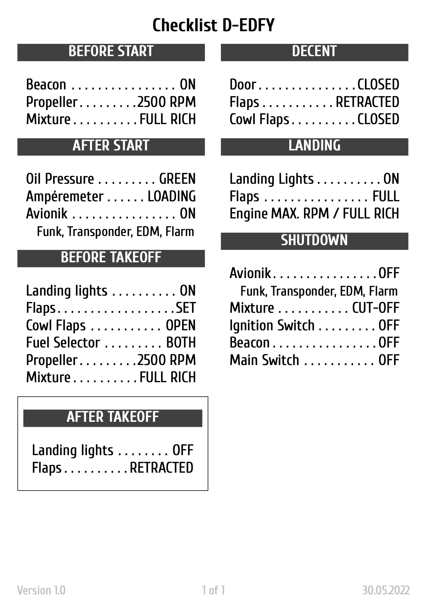

# Checklists template in LaTeX



This is a simple set of LaTex files to produce nice PDF formatted checklists.
You need to have a LaTex environment set up and `xelatex` available.

## Creating a checklist

First create a file called `checklist.tex` on source directory. You can use any name as long the
file has the extension `.tex`.

Here's an example of a simple checklist:

```Tex
\input{preamble.inc}

\begin{document}

\title{Demo Checklist}
\versionchecklist{1.0}
\datechecklist{30.05.2022}

\begin{checklist}{After Start}
  \item{Oil Pressure}{green}
  \item{Ampéremeter}{loading}
  \item{Avionik}{on}
    \hint{Funk, Transponder, EDM, Flarm}
\end{checklist}

\end{document}
```

## Supported Variables and Elements
| Type        | Name       | Usage                                                                        | Parameter            |
|-------------|------------|------------------------------------------------------------------------------|----------------------|
| Environment | memoryitem | Draws a box around the enclosed checklist group. Indication a memory item.   | none                 |
| Environment | checklist  | Defines the base environment for all further commands.                       | checklist_name       |
| Command     | item       | Base element for checklist, representing an individual step.                 | item_name, condition |
| Command     | hint       | Indented paragraph, used for notes within a step.                            | hint_text            |
| Command     | decision   | Creates a decision header.                                                   | decision_name        |
| Command     | step       | Subelement for decision, representing an indivudual step withing a decision. | item_name, condition |


## Build process
After this, running `make all` should output a PDF file on `pdf/` directory, which
will look similar to this:

You will find templates wihtin the `source` directory.